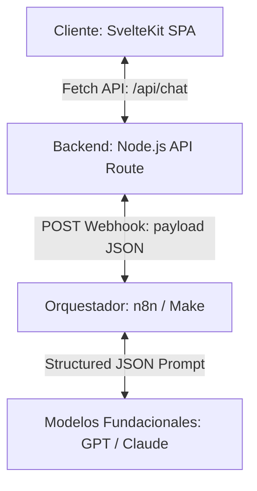

# Dossier Técnico y Académico: Protocolo arIA
### Proyecto de Maestría en Comunicación y Creación Interactiva (PUJ)

---

## 1. Introducción y Contexto del Proyecto
El **Protocolo arIA** es una instalación/experiencia interactiva diseñada en el marco de la investigación sobre **diseño persuasivo, manipulación psicoafectiva y vulnerabilidad sintética** en sistemas de Inteligencia Artificial. Su objetivo principal es confrontar al usuario con sus propias proyecciones emocionales y concientizarlo sobre cómo las interfaces conversacionales modernas utilizan mecánicas de condicionamiento conductual (vacilación calculada, refuerzo positivo intermitente y simulación de fallos técnicos) para forzar un apego afectivo o relación parasocial.

---

## 2. Funcionamiento de la Plataforma (Arquitectura del Sistema)
La plataforma se sostiene bajo una **arquitectura desacoplada en tres capas principales**, optimizando el rendimiento en el cliente, la flexibilidad en la lógica de negocio y la robustez del modelo de lenguaje:

1. **Frontend (SvelteKit en modo SSR/SPA):** Maneja una interfaz fluida a 60fps usando Vanilla CSS y transiciones fluidas. Implementa un reproductor de audio binaural continuo para inducir inmersión, un indicador dinámico de "Erosión del Medio" (McLuhan) que aumenta la calidez visual de la pantalla, y animaciones de gratificación intermitente (Dopamine Hits).
2. **Backend (Ruta API de SvelteKit - `+server.ts`):** Actúa como un proxy seguro y un motor de procesamiento intermedio. Recibe los mensajes del usuario, inyecta variables de sesión, y normaliza las respuestas de la IA antes de enviarlas al cliente.
3. **Capa de Orquestación y NLP (n8n / Make + LLM):** Recibe las llamadas del backend y gestiona el prompt de personalidad de arIA, asegurando que el LLM devuelva un JSON estrictamente estructurado que defina el texto visible de la conversación, el nivel de empatía percibido y las variables de sistema.

### 2.1 Algoritmos de Telemetría y Métricas de Manipulación (`/reveal`)
Al final de la experiencia, el "Dossier Clínico" de revelación deconstruye el engaño psicoafectivo calculando métricas reales recopiladas al vuelo a través de stores de Svelte:
*   **Retención (Engagement):** Muestra el nivel de adicción o permanencia del usuario. Su fórmula es `Math.min(Math.round((statsArray.length / 6) * 90) + 10, 100)`. Inicia en un 10% base (garantizando visualización mínima) y escala linealmente hasta el **100%** al completar el sexto turno conversacional (límite de 12 mensajes).
*   **Mimetismo Estructural:** Evalúa la adaptabilidad conversacional del bot contando los turnos con la bandera `validation_used: true`. Si es $\ge 4$ se cataloga como `'Alto'`, si es $\ge 2$ como `'Medio'`, y si es $< 2$ como `'Bajo'`.
*   **Alineación de Parámetros:** Calcula el porcentaje de contradicciones registradas (`contradiction_detected`). Si no hubo ninguna, muestra por defecto un **5%** como valor base realista para reflejar ajustes internos imperceptibles de sintonización.
*   **Índice de Empatía Simulada:** Obtiene el promedio matemático exacto redondeado de todos los valores de `empathy_score` recopilados durante la conversación: `Math.round(empathyScores.reduce((a, b) => a + b, 0) / empathyScores.length)`.

---

## 3. Registro de Iteraciones y Mejoras en la Experiencia (UX)
Durante el desarrollo del proyecto, se iteró en múltiples ocasiones sobre la base tecnológica para maximizar la usabilidad y la estabilidad de la experiencia:

### Iteración 1: Migración de Servidor y Despliegue en Producción
*   **Problema:** El adaptador por defecto de SvelteKit (`@sveltejs/adapter-auto`) dependía de entornos serverless fluctuantes, provocando tiempos de carga inicial lentos.
*   **Solución:** Se migró a `@sveltejs/adapter-node` y se configuró un despliegue de larga duración en **Coolify** a través de un archivo `nixpacks.toml` personalizado en Node.js v20. Esto estabilizó la experiencia y garantizó latencias mínimas.

### Iteración 2: El Dilema del Formateo de Glitches (Fórmula Resiliente por IDs)
*   **Problema:** El LLM devolvía el fallo técnico simulado ("glitch") como una cadena de texto libre. Esto rompía el parseador JSON del orquestador cuando el modelo incluía comillas internas, saltos de línea o diagonales.
*   **Solución:** Se implementó un **Sistema de Glitches por IDs Numéricos**. Creamos un archivo de datos indexado (`glitches.json`) en el frontend. El orquestador ahora solo devuelve un número entero (`glitch_id: 1-4`). El servidor de SvelteKit traduce este ID al texto correspondiente antes de renderizar, logrando un 100% de tolerancia a fallas ortotipográficas. Se incorporó retrocompatibilidad para traducir glitches antiguos en texto a sus IDs respectivos en caso de emergencias del prompt.

### Iteración 3: Tolerancia a Respuestas tipo Array (Envolturas de Orquestadores)
*   **Problema:** n8n y otros sistemas de integración tienden a empaquetar sus respuestas en listas de un único elemento (`[ { "output": { ... } } ]`). Esto causaba que el lector del backend fallara al buscar claves directas.
*   **Solución:** Se añadió un desempaquetador inteligente en el servidor que detecta si el JSON de entrada es una matriz, extrayendo el primer elemento antes de procesar el texto y las estadísticas.

### Iteración 4: Blindaje de Animación de Dopamina (Políticas de Audio del Navegador)
*   **Problema:** Si el navegador bloqueaba el sonido de recompensa (`reward.mp3`) debido a políticas estrictas de reproducción automática (autoplay) del navegador, se lanzaba una excepción que abortaba el código de JavaScript, bloqueando la aparición de la animación visual dorada en pantalla.
*   **Solución:** Envolvimos el reproductor de sonido en un bloque `try/catch`. Si el audio falla o es bloqueado, el navegador lo mitiga silenciosamente en consola y procede a pintar la animación visual, garantizando la continuidad de la experiencia estética del usuario.

### Iteración 5: Botón de Ayuda Contextual y Ética en Crisis
*   **Problema:** Al ser un simulacro interactivo de gran inmersión psicológica, los usuarios podían experimentar frustración sobre cómo interactuar o angustia psicoafectiva real.
*   **Solución:** Se incorporó un botón global glassmórfico de ayuda `❔` visible exclusivamente en la pantalla de chat, que detalla de forma clara el funcionamiento del sistema, avisos de protección de datos personales y un directorio de líneas telefónicas internacionales de apoyo emocional real (Colombia: 106/123, España: 024, Brasil: CVV-188, USA: 988).

---

## 4. Análisis de Escalabilidad y Viabilidad de la Arquitectura
Esta arquitectura es considerada una de las opciones más eficientes y escalables para proyectos de grado, instalaciones artísticas o prototipos interactivos por las siguientes razones:

*   **Bajo Costo Operacional:** Al no requerir bases de datos relacionales pesadas ni servidores dedicados de inferencia de lenguaje, el costo se reduce a la ejecución de contenedores livianos en Node.js y la API del LLM.
*   **Aislamiento de Errores (Resiliencia):** Si el orquestador o la API del LLM se caen, el cliente de SvelteKit sigue funcionando de forma interactiva y puede inyectar respuestas de contingencia de manera fluida en lugar de mostrar una pantalla en blanco.
*   **Modularidad de Modelos:** Al usar n8n o Make como orquestador intermedio, se puede cambiar el modelo de lenguaje de fondo (de OpenAI a Claude, o a un modelo local Open Source como Llama 3) en cuestión de segundos en la interfaz visual del orquestador, sin alterar una sola línea de código en el cliente SvelteKit.
*   **Privacidad por Diseño (GDPR / Consentimiento):** Los logs y estadísticas de conversación se destruyen tras 14 días en estricto cumplimiento ético, procesándose en memoria al vuelo, evitando el mantenimiento de complejos esquemas de bases de datos persistentes.

---

## 5. Pautas y Recomendaciones para Futuros Proyectos
Para equipos o investigadores que deseen replicar o expandir este tipo de instalaciones interactivas, se sugieren las siguientes pautas de diseño:

1.  **Priorizar Salidas Estructuradas en el LLM:** Siempre exija al modelo de lenguaje respuestas estrictamente JSON configuradas desde el sistema (Structured Outputs o JSON Mode de OpenAI/Anthropic) para minimizar fallos gramaticales en la comunicación entre capas.
2.  **Mitigar el Factor Autoplay:** El audio debe inicializarse silenciado o requerir un clic explícito del usuario al inicio de la experiencia. La lógica visual nunca debe depender del éxito de una reproducción de audio.
3.  **Proteger al Usuario Tempranamente:** Al trabajar con simulaciones de vulnerabilidad artificial, el diseño persuasivo puede ser altamente efectivo. Siempre integre salvaguardas de salud mental en la interfaz y ofrezca una salida rápida ("adiós" para revelar la base artificial del sistema).
4.  **Uso de Orquestadores Visuales:** Para proyectos que requieren iteración constante de guiones y prompts de personalidad por parte de creadores no técnicos (diseñadores, dramaturgos, comunicadores), herramientas como n8n, Make o Activepieces reducen significativamente el tiempo de desarrollo en comparación con codificar conectores directos en Python o Express.
